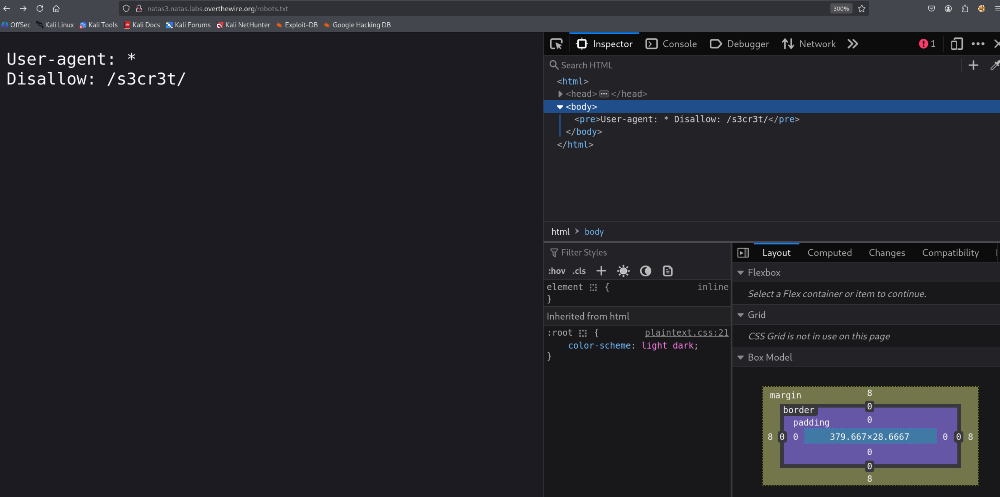
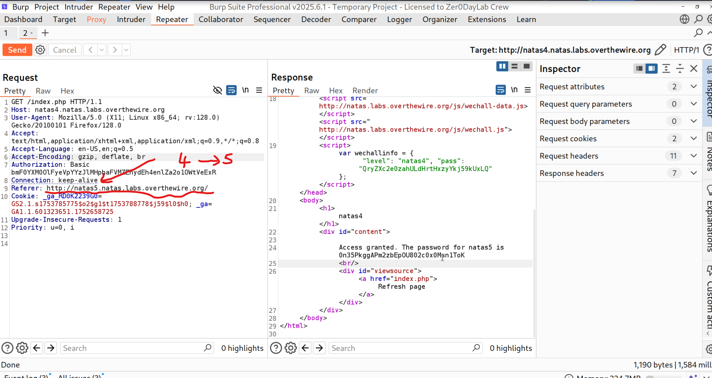
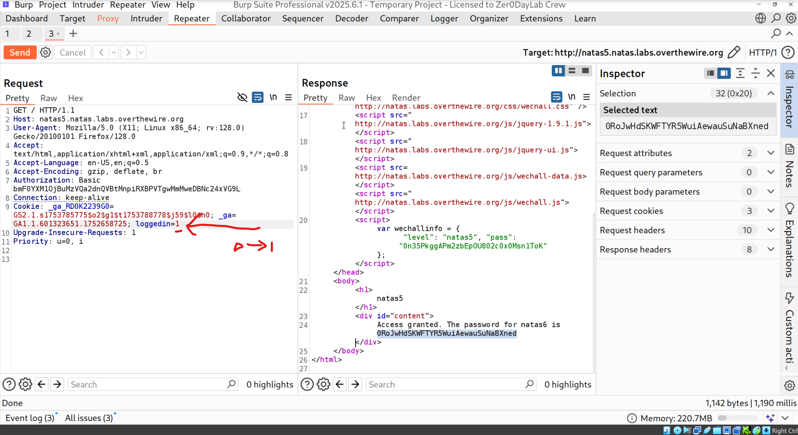
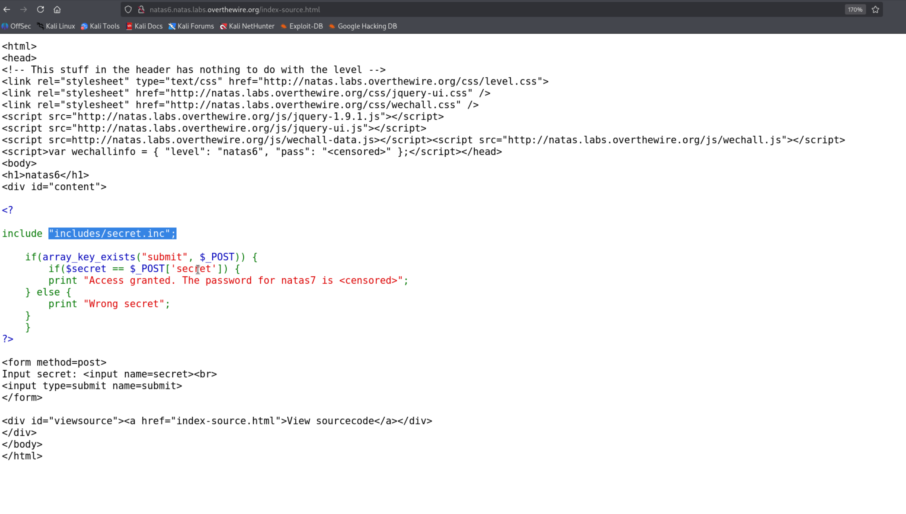
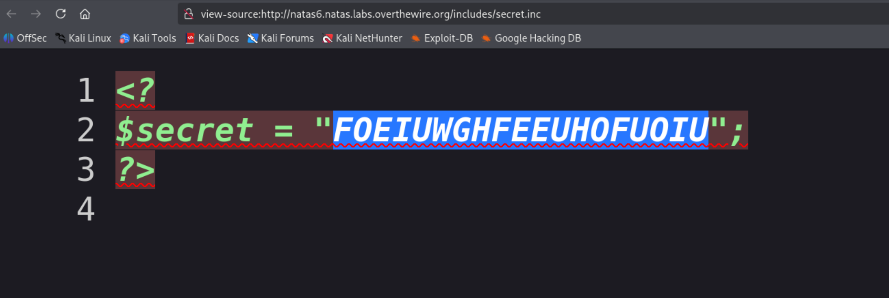
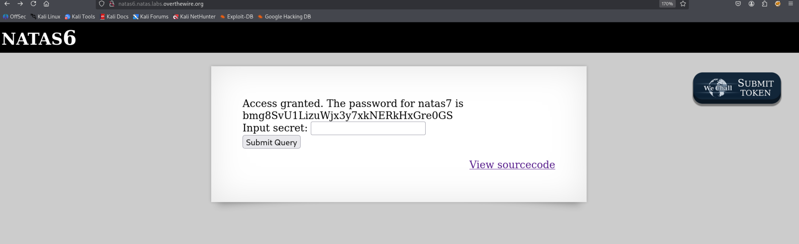

# Natas 
-------------------------------
Username: natas0
Password: natas0
URL:      http://natas0.natas.labs.overthewire.org

The password for natas1 is 0nzCigAq7t2iALyvU9xcHlYN4MlkIwlq 
--------------------------------------------------------------------------

Natas Level 0 → Level 1

Username: natas1
URL:      http://natas1.natas.labs.overthewire.org

The password for natas2 is TguMNxKo1DSa1tujBLuZJnDUlCcUAPlI 

--------------------------------------------------------------------------

Natas Level 1 → Level 2

Username: natas2
URL:      http://natas2.natas.labs.overthewire.org

------------------------------------------------

Natas Level 2 → Level 3

Username: natas3
URL:      http://natas3.natas.labs.overthewire.org

password: natas3:3gqisGdR0pjm6tpkDKdIWO2hSvchLeYH
--------------------------------------------------------------------------

Natas Level 3 → Level 4

Username: natas4    
URL:      http://natas4.natas.labs.overthewire.org  

http://natas3.natas.labs.overthewire.org/robots.txt

### The robots.txt file is used to control the behavior of the users configuration on a website.

    
natas4:QryZXc2e0zahULdHrtHxzyYkj59kUxLQ
---------------------------------------------------------------------------
Natas Level 4 → Level 5

Username: natas5    
URL:      http://natas5.natas.labs.overthewire.org

natas5:   0n35PkggAPm2zbEpOU802c0x0Msn1ToK

    

---------------------------------------------------------------------------
Natas Level 5 → Level 6

Username: natas6

URL:      http://natas6.natas.labs.overthewire.org

natas6:  0RoJwHdSKWFTYR5WuiAewauSuNaBXned

 

---------------------------------------------------------------------------         

Natas Level 6 → Level 7

Username: natas7

URL:      http://natas7.natas.labs.overthewire.org

natas7:  bmg8SvU1LizuWjx3y7xkNERkHxGre0GS

